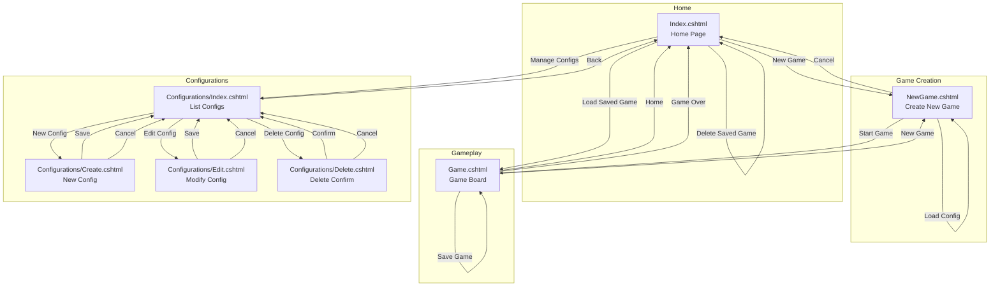
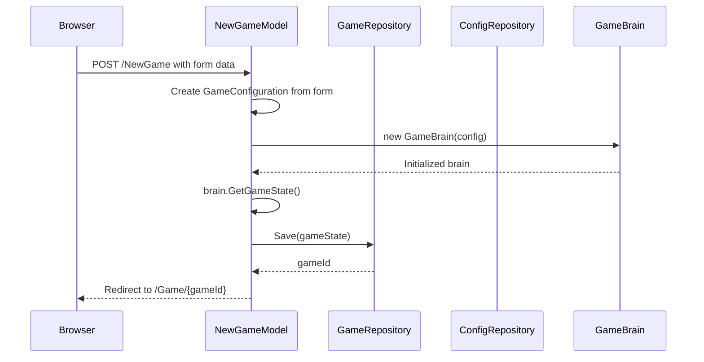
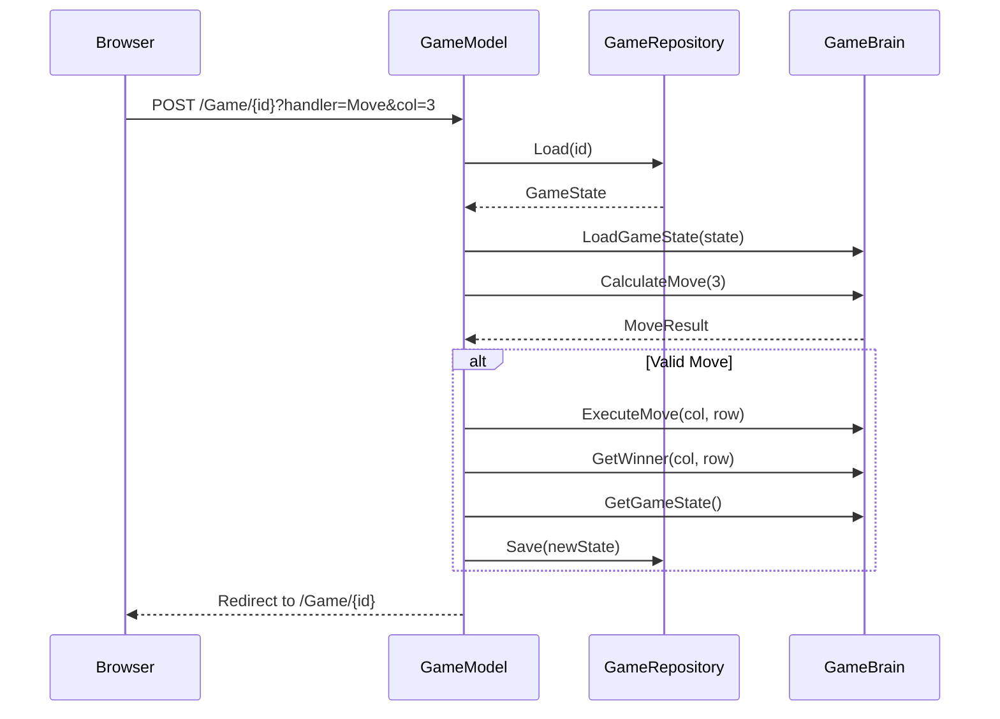
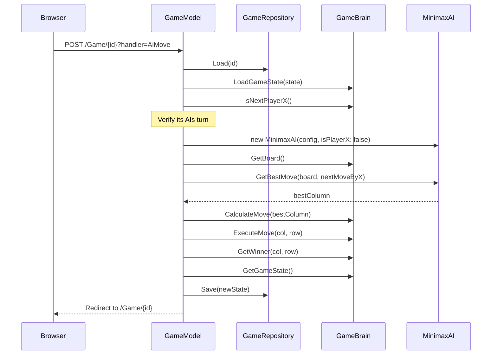

# WebApp Architecture: HyperConnectX

## Overview

The HyperConnectX WebApp is an ASP.NET Core Razor Pages application that provides a web-based interface for the Connect X game. It reuses the existing BLL (Business Logic Layer) and DAL (Data Access Layer) components, maintaining consistency with the console application.

### Key Design Decisions

| Decision | Rationale |
|----------|-----------|
| Razor Pages over MVC | Simpler page-focused architecture, each page is self-contained |
| No WebSocket/SignalR | Page refresh for updates keeps complexity low |
| Unique game URLs | Games accessible via `/Game/{id}` without lobby system |
| Minimal JavaScript | Server-side rendering with CSS for interactions |
| Session-based turn validation | Prevent unauthorized moves in PvP mode |

---

## Page Flow Diagram



---

## Route Structure

| Route | Page | HTTP Methods | Description |
|-------|------|--------------|-------------|
| `/` | Index.cshtml | GET | Home page with saved games list |
| `/Index?handler=Delete&id={guid}` | Index.cshtml | POST | Delete a saved game |
| `/NewGame` | NewGame.cshtml | GET | Display game creation form |
| `/NewGame` | NewGame.cshtml | POST | Create new game and redirect to play |
| `/NewGame?configId={guid}` | NewGame.cshtml | GET | Pre-fill form with saved config |
| `/Game/{id}` | Game.cshtml | GET | Display game board |
| `/Game/{id}?handler=Move&col={n}` | Game.cshtml | POST | Make a move in column n |
| `/Game/{id}?handler=Save` | Game.cshtml | POST | Save current game state |
| `/Game/{id}?handler=AiMove` | Game.cshtml | POST | Trigger AI move (PvC mode) |
| `/Configurations` | Configurations/Index.cshtml | GET | List all configurations |
| `/Configurations/Create` | Configurations/Create.cshtml | GET, POST | Create new configuration |
| `/Configurations/Edit/{id}` | Configurations/Edit.cshtml | GET, POST | Edit configuration |
| `/Configurations/Delete/{id}` | Configurations/Delete.cshtml | GET, POST | Delete confirmation |

---

## Page Models

### IndexModel (Index.cshtml.cs)

```csharp
public class IndexModel : PageModel
{
    // Dependencies
    private readonly IRepository<GameState> _gameRepository;

    // View Properties
    public List<GameListItem> SavedGames { get; set; } = new();
    
    // Handlers
    public void OnGet()              // Load saved games list
    public IActionResult OnPostDelete(string id)  // Delete saved game
}

public class GameListItem
{
    public string Id { get; set; }
    public string SaveName { get; set; }
    public string Description { get; set; }  // Board size, etc.
    public string Mode { get; set; }         // PvP or PvC
}
```

### NewGameModel (NewGame.cshtml.cs)

```csharp
public class NewGameModel : PageModel
{
    // Dependencies
    private readonly IRepository<GameConfiguration> _configRepository;
    private readonly IRepository<GameState> _gameRepository;

    // Form Binding
    [BindProperty]
    public GameFormModel Form { get; set; } = new();

    // View Properties  
    public List<ConfigListItem> SavedConfigs { get; set; } = new();

    // Handlers
    public void OnGet(string? configId)        // Display form, optionally pre-fill
    public IActionResult OnPost()              // Create game, redirect to /Game/{id}
}

public class GameFormModel
{
    public string Name { get; set; } = "New Game";
    public int BoardWidth { get; set; } = 7;
    public int BoardHeight { get; set; } = 6;
    public int ConnectHow { get; set; } = 4;
    public string P1Name { get; set; } = "Player 1";
    public string P2Name { get; set; } = "Player 2";
    public EGameMode Mode { get; set; } = EGameMode.PvP;
    public bool IsCylindrical { get; set; } = false;
}
```

### GameModel (Game.cshtml.cs)

```csharp
public class GameModel : PageModel
{
    // Dependencies
    private readonly IRepository<GameState> _gameRepository;

    // Route Parameter
    [BindProperty(SupportsGet = true)]
    public string Id { get; set; } = default!;

    // View Properties
    public GameState GameState { get; set; } = default!;
    public GameBrain GameBrain { get; set; } = default!;
    public ECellState[,] Board { get; set; } = default!;
    public ECellState? Winner { get; set; }
    public bool IsDraw { get; set; }
    public bool IsGameOver => Winner.HasValue || IsDraw;
    public bool IsAiTurn { get; set; }
    public string CurrentPlayerName { get; set; } = default!;
    public string? Message { get; set; }

    // Handlers
    public IActionResult OnGet()                    // Load and display game
    public IActionResult OnPostMove(int col)        // Process player move
    public IActionResult OnPostSave()               // Save game to repository
    public IActionResult OnPostAiMove()             // Execute AI move (PvC)
}
```

### Configurations/IndexModel

```csharp
public class IndexModel : PageModel
{
    private readonly IRepository<GameConfiguration> _configRepository;

    public List<ConfigListItem> Configurations { get; set; } = new();

    public void OnGet()                             // List all configs
}

public class ConfigListItem
{
    public string Id { get; set; }
    public string Name { get; set; }
    public string Description { get; set; }  // "7x6, Connect 4"
}
```

### Configurations/CreateModel

```csharp
public class CreateModel : PageModel
{
    private readonly IRepository<GameConfiguration> _configRepository;

    [BindProperty]
    public ConfigFormModel Form { get; set; } = new();

    public void OnGet()                             // Display empty form
    public IActionResult OnPost()                   // Save new config
}

public class ConfigFormModel
{
    public string Name { get; set; } = "My Config";
    public int BoardWidth { get; set; } = 7;
    public int BoardHeight { get; set; } = 6;
    public int ConnectHow { get; set; } = 4;
    public bool IsCylindrical { get; set; } = false;
}
```

### Configurations/EditModel

```csharp
public class EditModel : PageModel
{
    private readonly IRepository<GameConfiguration> _configRepository;

    [BindProperty(SupportsGet = true)]
    public string Id { get; set; } = default!;

    [BindProperty]
    public ConfigFormModel Form { get; set; } = new();

    public IActionResult OnGet()                    // Load config into form
    public IActionResult OnPost()                   // Save changes
}
```

### Configurations/DeleteModel

```csharp
public class DeleteModel : PageModel
{
    private readonly IRepository<GameConfiguration> _configRepository;

    [BindProperty(SupportsGet = true)]
    public string Id { get; set; } = default!;

    public GameConfiguration Config { get; set; } = default!;

    public IActionResult OnGet()                    // Show confirmation
    public IActionResult OnPost()                   // Delete and redirect
}
```

---

## Data Flow

### Game Creation Flow



### Move Execution Flow (PvP)



### AI Move Flow (PvC)



---

## Game State Management

### State Storage Strategy

Games are persisted to the database immediately upon creation and after each move:

1. **Game Creation**: New [`GameState`](../BLL/GameState.cs:6) entity saved with generated `Guid` ID
2. **Each Move**: State updated via [`GameBrain.GetGameState()`](../BLL/GameBrain.cs:197) and re-saved
3. **Game Access**: Via unique URL `/Game/{id}` where `id` is the `Guid`

### In-Memory Game Brain

For each request:
1. Load [`GameState`](../BLL/GameState.cs:6) from repository
2. Create [`GameBrain`](../BLL/GameBrain.cs:3) instance and call [`LoadGameState()`](../BLL/GameBrain.cs:207)
3. Execute operations on `GameBrain`
4. Extract state via [`GetGameState()`](../BLL/GameBrain.cs:197) and save back

### Turn Tracking

- [`GameState.NextMoveByX`](../BLL/GameState.cs:19) tracks whose turn it is
- In PvP mode: Both players can access the same URL, game state determines valid moves
- In PvC mode: Player is always X (first), AI is always O (second)

### PvP Turn Validation

Since both players share the same URL, optional session-based validation can prevent race conditions:

```csharp
// Optional: Track which browser session made last move
HttpContext.Session.SetString($"LastMoveBy_{Id}", "X");
```

---

## Board Rendering Strategy

### HTML Structure

The board uses a CSS Grid layout with clickable column headers:

```html
<div class="game-container">
    <!-- Column Selection Buttons -->
    <div class="column-buttons">
        @for (int col = 0; col < Model.Board.GetLength(0); col++)
        {
            <form method="post" asp-page-handler="Move" asp-route-col="@col" class="column-form">
                <button type="submit" 
                        class="column-btn @(Model.IsGameOver ? "disabled" : "")"
                        @(Model.IsGameOver || Model.IsAiTurn ? "disabled" : "")>
                    ▼
                </button>
            </form>
        }
    </div>

    <!-- Game Board Grid -->
    <div class="board" style="--cols: @Model.Board.GetLength(0); --rows: @Model.Board.GetLength(1);">
        @for (int row = 0; row < Model.Board.GetLength(1); row++)
        {
            @for (int col = 0; col < Model.Board.GetLength(0); col++)
            {
                var cell = Model.Board[col, row];
                <div class="cell @GetCellClass(cell)">
                    <div class="piece"></div>
                </div>
            }
        }
    </div>
</div>

@functions {
    string GetCellClass(ECellState state) => state switch
    {
        ECellState.X => "piece-x",
        ECellState.O => "piece-o",
        ECellState.XWin => "piece-x winning",
        ECellState.OWin => "piece-o winning",
        _ => "empty"
    };
}
```

### Cylindrical Mode Indicator

For cylindrical boards, display visual wrap-around indicators:

```html
@if (Model.GameBrain.GetIsCylindrical())
{
    <div class="cylindrical-indicator">
        <span class="wrap-arrow left">⟲</span>
        <span class="mode-label">Cylindrical Mode</span>
        <span class="wrap-arrow right">⟳</span>
    </div>
}
```

---

## CSS Structure

### File Organization

```
wwwroot/
├── css/
│   ├── site.css          # Global styles, layout
│   ├── game.css          # Game board specific styles
│   └── forms.css         # Form styling
```

### Key CSS Classes

```css
/* site.css - Layout */
.container { max-width: 1200px; margin: 0 auto; padding: 1rem; }
.nav-link { color: #007bff; text-decoration: none; }
.btn { padding: 0.5rem 1rem; border-radius: 4px; cursor: pointer; }
.btn-primary { background: #007bff; color: white; border: none; }
.btn-danger { background: #dc3545; color: white; border: none; }

/* game.css - Board */
.game-container {
    display: flex;
    flex-direction: column;
    align-items: center;
    gap: 0.5rem;
}

.column-buttons {
    display: flex;
    gap: 2px;
}

.column-btn {
    width: 50px;
    height: 30px;
    background: #4CAF50;
    color: white;
    border: none;
    cursor: pointer;
    font-size: 1.2rem;
}

.column-btn:hover:not(.disabled) {
    background: #45a049;
}

.column-btn.disabled {
    background: #ccc;
    cursor: not-allowed;
}

.board {
    display: grid;
    grid-template-columns: repeat(var(--cols), 50px);
    grid-template-rows: repeat(var(--rows), 50px);
    gap: 2px;
    background: #1a5fb4;  /* Classic Connect 4 blue */
    padding: 10px;
    border-radius: 8px;
}

.cell {
    width: 50px;
    height: 50px;
    background: #1a5fb4;
    border-radius: 50%;
    display: flex;
    align-items: center;
    justify-content: center;
}

.cell .piece {
    width: 42px;
    height: 42px;
    border-radius: 50%;
    background: #e8e8e8;  /* Empty cell - hole appearance */
}

.cell.piece-x .piece {
    background: #ff4136;  /* Red for X */
    box-shadow: inset 0 -3px 5px rgba(0,0,0,0.3);
}

.cell.piece-o .piece {
    background: #ffdc00;  /* Yellow for O */
    box-shadow: inset 0 -3px 5px rgba(0,0,0,0.3);
}

.cell.winning .piece {
    animation: pulse 0.5s infinite alternate;
}

@keyframes pulse {
    from { transform: scale(1); }
    to { transform: scale(1.1); }
}

/* Game Status */
.game-status {
    font-size: 1.5rem;
    font-weight: bold;
    margin: 1rem 0;
}

.game-status.player-x { color: #ff4136; }
.game-status.player-o { color: #b8860b; }
.game-status.winner { color: #28a745; }
.game-status.draw { color: #6c757d; }

/* Cylindrical Mode */
.cylindrical-indicator {
    display: flex;
    align-items: center;
    gap: 0.5rem;
    color: #6c757d;
    font-style: italic;
}

.wrap-arrow {
    font-size: 1.5rem;
}

/* forms.css - Forms */
.form-group {
    margin-bottom: 1rem;
}

.form-group label {
    display: block;
    margin-bottom: 0.25rem;
    font-weight: 500;
}

.form-control {
    width: 100%;
    padding: 0.5rem;
    border: 1px solid #ced4da;
    border-radius: 4px;
}

.form-check {
    display: flex;
    align-items: center;
    gap: 0.5rem;
}

.validation-error {
    color: #dc3545;
    font-size: 0.875rem;
}
```

---

## PvC (Player vs Computer) Flow

### Game Mode Detection

```csharp
public bool IsAiTurn => 
    GameState.Configuration?.Mode == EGameMode.PvC && 
    !GameBrain.IsNextPlayerX() &&  // AI is always O
    !IsGameOver;
```

### AI Move Trigger

In PvC mode, after player moves, the page shows an "AI is thinking..." message with a form to trigger AI move:

```html
@if (Model.IsAiTurn)
{
    <div class="ai-thinking">
        <p>AI is thinking...</p>
        <form method="post" asp-page-handler="AiMove">
            <button type="submit" class="btn btn-primary">
                Execute AI Move
            </button>
        </form>
    </div>
}
```

### Alternative: Auto-redirect for AI

For smoother UX, auto-redirect to AI move handler:

```html
@if (Model.IsAiTurn)
{
    <meta http-equiv="refresh" content="1;url=/Game/@Model.Id?handler=AiMove" />
    <p>AI is making its move...</p>
}
```

### AI Implementation

```csharp
public IActionResult OnPostAiMove()
{
    LoadGame();
    
    if (!IsAiTurn)
        return RedirectToPage();
    
    var ai = new MinimaxAI(
        GameState.Configuration!, 
        isPlayerX: false,  // AI is always O
        maxDepth: 6
    );
    
    var bestCol = ai.GetBestMove(Board, GameBrain.IsNextPlayerX());
    var result = GameBrain.CalculateMove(bestCol);
    
    if (result.IsValid)
    {
        GameBrain.ExecuteMove(result.Column, result.FinalRow);
        Winner = GameBrain.GetWinner(result.Column, result.FinalRow);
        SaveGame();
    }
    
    return RedirectToPage();
}
```

---

## Project Structure

```
WebApp/
├── Pages/
│   ├── _ViewImports.cshtml       # Tag helpers, using statements
│   ├── _ViewStart.cshtml         # Layout reference
│   ├── Shared/
│   │   ├── _Layout.cshtml        # Main layout with nav
│   │   └── _ValidationScripts.cshtml  # Client validation
│   ├── Index.cshtml              # Home page
│   ├── Index.cshtml.cs
│   ├── NewGame.cshtml            # Game creation
│   ├── NewGame.cshtml.cs
│   ├── Game.cshtml               # Game board
│   ├── Game.cshtml.cs
│   ├── Error.cshtml              # Error page
│   └── Configurations/
│       ├── Index.cshtml          # List configs
│       ├── Index.cshtml.cs
│       ├── Create.cshtml         # Create config
│       ├── Create.cshtml.cs
│       ├── Edit.cshtml           # Edit config
│       ├── Edit.cshtml.cs
│       ├── Delete.cshtml         # Delete confirmation
│       └── Delete.cshtml.cs
├── wwwroot/
│   ├── css/
│   │   ├── site.css
│   │   ├── game.css
│   │   └── forms.css
│   ├── js/
│   │   └── site.js               # Minimal JS if needed
│   └── favicon.ico
├── Program.cs                    # App entry point, DI setup
├── appsettings.json             # Configuration
└── WebApp.csproj                # Project file
```

---

## Dependency Injection Setup

### Program.cs

```csharp
var builder = WebApplication.CreateBuilder(args);

// Add services
builder.Services.AddRazorPages();

// Database context
builder.Services.AddDbContext<AppDbContext>(options =>
    options.UseSqlite($"Data Source={Path.Combine(
        Environment.GetFolderPath(Environment.SpecialFolder.UserProfile), 
        "app.db"
    )}"));

// Repositories
builder.Services.AddScoped<IRepository<GameConfiguration>, ConfigRepositoryEF>();
builder.Services.AddScoped<IRepository<GameState>, GameRepositoryEF>();

// Session (optional, for turn tracking)
builder.Services.AddDistributedMemoryCache();
builder.Services.AddSession(options =>
{
    options.IdleTimeout = TimeSpan.FromHours(24);
    options.Cookie.HttpOnly = true;
});

var app = builder.Build();

// Ensure database is created
using (var scope = app.Services.CreateScope())
{
    var db = scope.ServiceProvider.GetRequiredService<AppDbContext>();
    db.Database.Migrate();
}

app.UseStaticFiles();
app.UseRouting();
app.UseSession();  // If using sessions
app.MapRazorPages();

app.Run();
```

---

## Form Validation

### Client-Side (Minimal JS)

Using ASP.NET Core's built-in validation with data annotations:

```csharp
public class GameFormModel
{
    [Required]
    [StringLength(50, MinimumLength = 1)]
    public string Name { get; set; } = "New Game";

    [Range(3, 20)]
    public int BoardWidth { get; set; } = 7;

    [Range(3, 20)]
    public int BoardHeight { get; set; } = 6;

    [Range(2, 20)]
    public int ConnectHow { get; set; } = 4;
}
```

### Server-Side Validation

```csharp
public IActionResult OnPost()
{
    // Custom validation: ConnectHow <= min(Width, Height)
    if (Form.ConnectHow > Math.Min(Form.BoardWidth, Form.BoardHeight))
    {
        ModelState.AddModelError("Form.ConnectHow", 
            $"Connect count cannot exceed {Math.Min(Form.BoardWidth, Form.BoardHeight)}");
    }

    if (!ModelState.IsValid)
        return Page();

    // Create game...
}
```

---

## Error Handling

### Exception Handling Middleware

```csharp
// In Program.cs
if (!app.Environment.IsDevelopment())
{
    app.UseExceptionHandler("/Error");
}
```

### Game Not Found

```csharp
public IActionResult OnGet()
{
    try
    {
        GameState = _gameRepository.Load(Id);
    }
    catch (KeyNotFoundException)
    {
        return RedirectToPage("/Index");
    }
    // ...
}
```

---

## Security Considerations

1. **Input Sanitization**: Game names and config names are sanitized (see [`GameRepositoryEF.Save()`](../DAL/GameRepositoryEF.cs:40))
2. **GUID IDs**: Unpredictable game URLs via `Guid` identifiers
3. **CSRF Protection**: Built-in with Razor Pages form posts
4. **No Authentication**: Games are public by URL (design choice for simplicity)

---

## Testing Strategy

### Unit Tests (Recommended)
- Test [`GameBrain`](../BLL/GameBrain.cs:3) move validation and win detection
- Test [`MinimaxAI`](../BLL/MinimaxAI.cs:3) move selection
- Test repository operations

### Integration Tests
- Test page handlers with mock repositories
- Test game creation flow
- Test move execution flow

### Manual Testing
- Test with various board sizes (3x3 to 20x20)
- Test cylindrical mode wrap-around
- Test AI difficulty feels appropriate

---

## Browser Support

Target modern browsers with CSS Grid support:
- Chrome 57+
- Firefox 52+
- Safari 10.1+
- Edge 16+

No polyfills required for the minimal JS approach.
